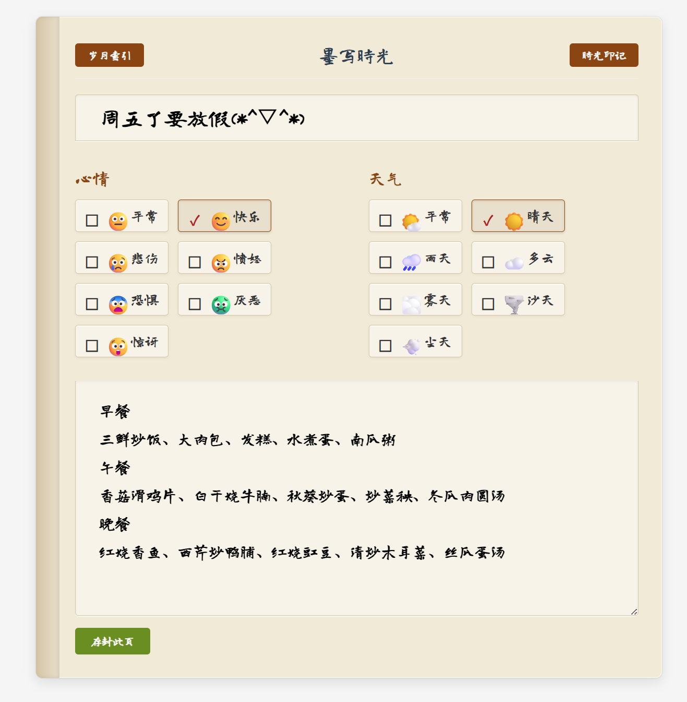

# Daily Writer - A Retro Diary Web Application

 

## 1. Project Introduction
This is a retro-style diary web application that is deployed locally and does not upload data to the cloud.

## 2. Project Dependencies
- Python (recommended: Python 11)

## 3. Project Installation
1. Clone the project: git clone https://github.com/Sherlock-L/daily-writer.git

2. Install dependencies
   - Optional: If you have a conda environment, it's recommended to create a new environment with Python 3.11: conda create -n daily python=3.11
   - Optional: Activate the environment: conda activate daily
   - Navigate to the api directory: cd api, then install requirements: pip install -r requirements.txt

3. Create Database Tables
Import and execute from init.sql.
   - Database: MySQL
   - Database name: diary_db
   - Table name: diary

4. Configure Database (config.py)

5. Run the Project
   - Windows 11: start.bat
   - Linux:
     1. Frontend: cd front && python -m http.server 10086
     2. Backend: cd api && python main.py