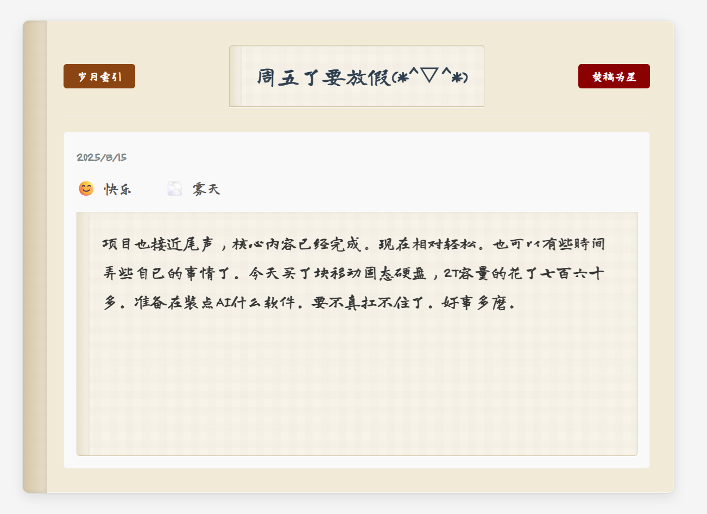

# 1. ​​项目简介：复古日记 —— 回归书写的本质​
✍️ 初心​​

在这个信息爆炸的时代，我们被各种「高效」「智能」「多功能」的笔记软件包围，却渐渐忘记了写日记最原始的感动。

​​复古日记​​的诞生，源于一个简单的愿望：​​找回纸笔写日记的纯粹​​。没有繁杂的功能，没有花哨的界面，只有你与文字之间的对话，就像从前在泛黄纸页上落笔时那样，安静、专注、自由。



[](README.md) [](README_EN.md)

# 2. 项目依赖
- python ，推荐python 11
- Mysql Server

# 3. 项目安装
1. 克隆项目 : git clone https://github.com/Sherlock-L/daily-writer.git

2. 安装依赖  
- 可选：如果有conda环境，建议创建一个新环境，python版本3.11。 conda create -n daily python=3.11
- 可选：进入环境：conda activate daily
- cd api  ，  pip install -r requirements.txt

3.创建库表
从init.sql导入sql执行。
- 数据库：mysql
- 库名：diary_db
- 表名：diary


4. 配置数据库  config.py
```
DB_USER = 'mysql用户'
DB_PASSWORD = 'mysql密码'
DB_NAME = 'diary_db'
```
5. 运行项目
- win11: start.bat
- linux:  
 1. 前端：cd   front && python -m http.server 50000  
 2. 后端：cd   api && python main.py


